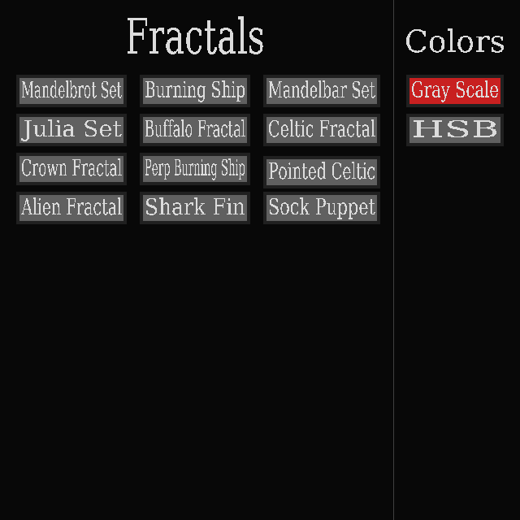
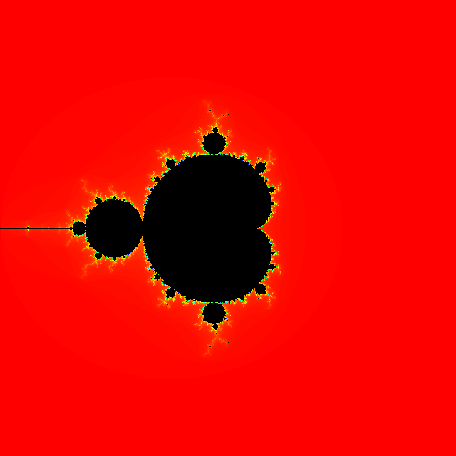
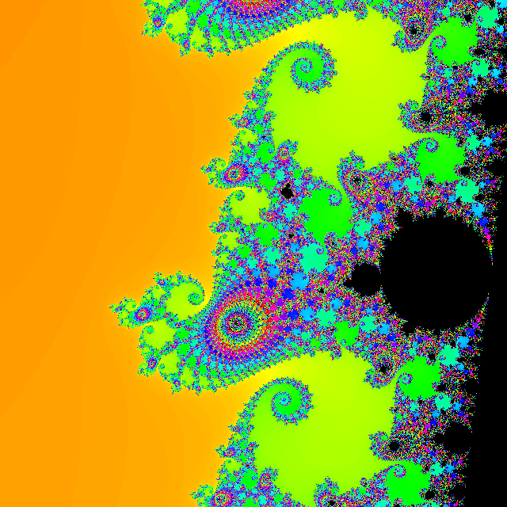
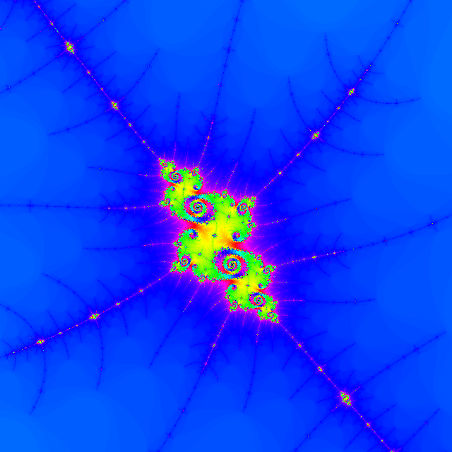
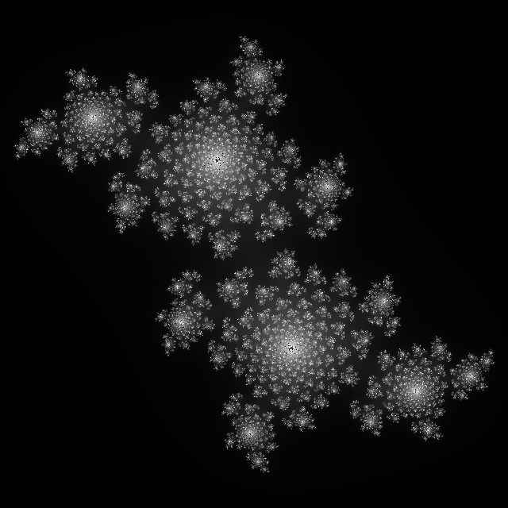
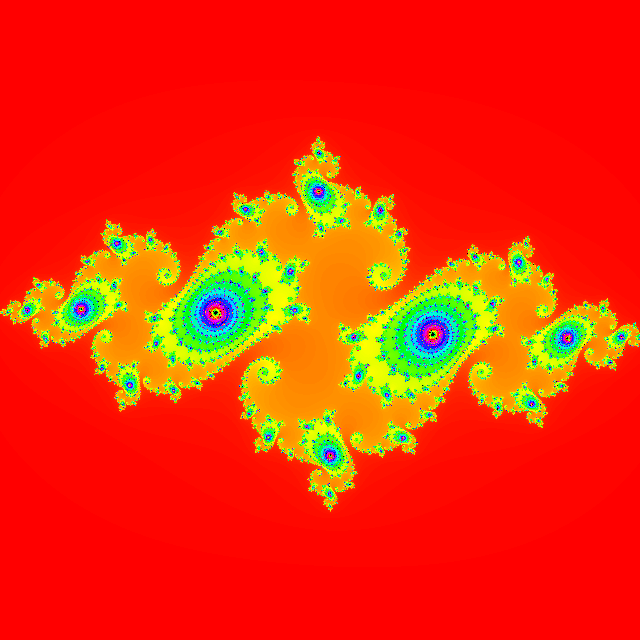
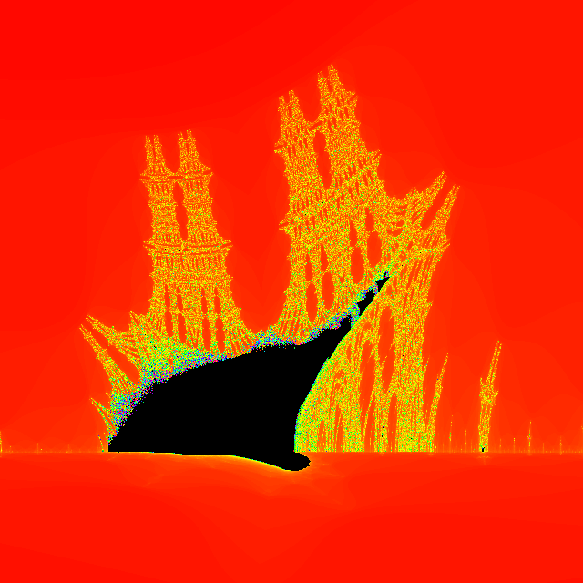
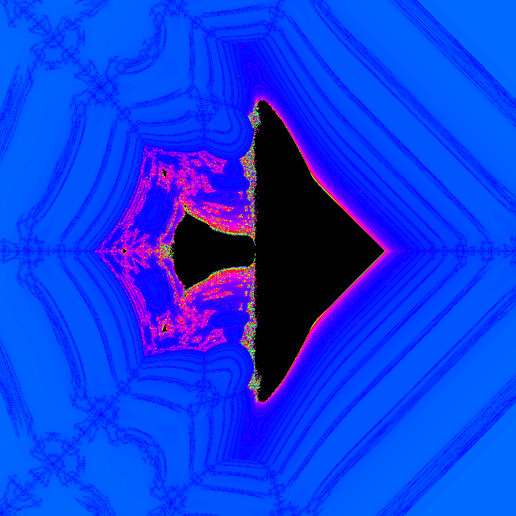
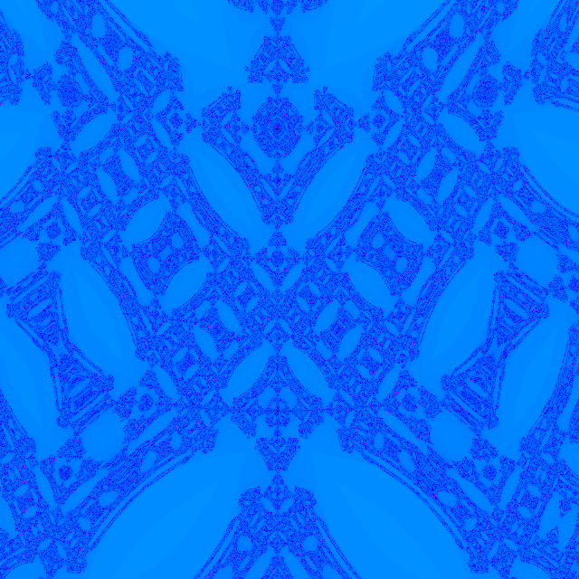
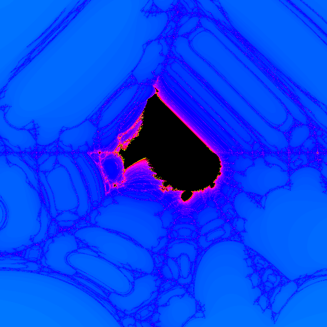

# Complex-Fractal-Visualizer

A real time rendering tool for visualizing complex fractals such as the Mandelbrot set and Julia sets.

## Dependences
* sdl2
* sdl2_ttf

## SIMD
I used avx2 (Advanced Vector Extensions) to speed up the rendering so if your using a cpu created before 2013 this code will not work on your machine.
If your cpu is newer than 2013 it should be fine, probably.

## Building
* `make` to build
* then `make clean` to get rid of .o files
* `./bin` to run

## Key Binds

### mouse
* left click and drag to move around
* scroll wheel to zoom in and out
### escape
* returns to menu
### i 
* increases iterations
### o
* decreases iterations
### z
* zoom in around center of screen
### x
* zoom out around center of screen
### arrow keys
* the arrow keys move around the c constant in the Julia set

## Images

#### Menu

#### Mandelbrot set image 1

#### Mandelbrot set image 2

#### Mandelbrot set image 2

#### Julia set image 1

#### Julia set image 2

#### Burning ship fractal image 1

#### Pointer Celtic fractal

#### Crown fractal image 1

#### Crown fractal image 2

#### Sharkfin fractal

